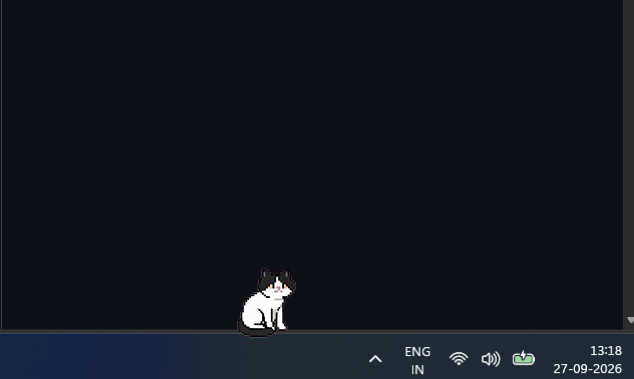
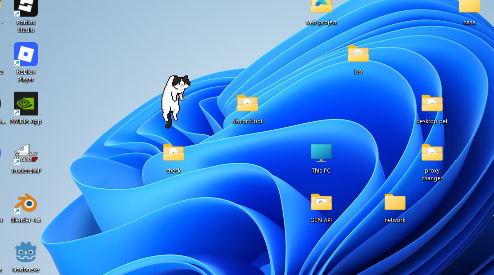
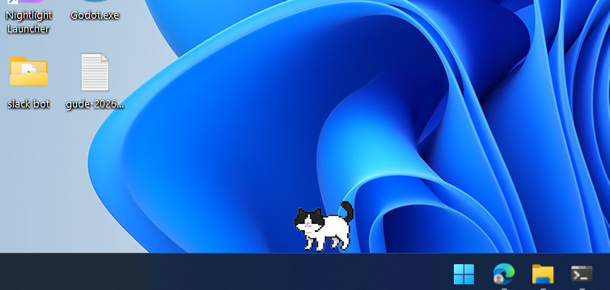
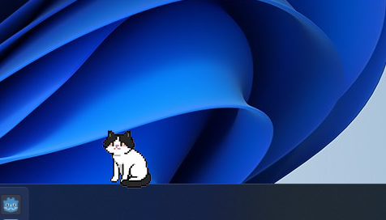

# Kio — Desktop Pixel Cat

A living, breathing pixel cat that roams around your Windows taskbar. Built with **Godot 4**.

---

## Features

- Roams around your taskbar
- Fully autonomous with a built-in behavior brain

---

## Requirements

- [Godot 4.7+](https://godotengine.org/download)
- Windows OS

---

## How to Run

1. Open the project in **Godot 4**
2. Press **F5** to run

---
## Animations






## Animation States

| State | Description |
|---|---|
| `stand` | Idle standing |
| `sit` | Sitting |
| `sleep` | Sleeping (triggers after 2 min of mouse inactivity) |
| `walk` | Walking |
| `run` | Running (faster than walk) |
| `body_stretch` | Stretch after waking from sleep |
| `grab` | Being picked up by mouse |
| `grab_to_drop` | Falling animation after being dropped |
| `drop_to_stand` | Landing animation when hitting the ground |
| `backsit` | Sitting facing backwards |
| `stand_to_backsit` | Transition to backsit |
| `backsit_to_stand` | Transition from backsit to stand |
| `backshit_hand_lick` | Grooming animation, plays randomly while in backsit |
| `sit_to_standup` | Transition from sit/sleep to stand |
| `standup_to_sit` | Transition from stand to sit |

---

## Controls

| Action | Result |
|---|---|
| **Left click + drag** | Pick up and move Kio |
| **Release** | Drop Kio (plays falling + landing animation) |
| **Move mouse near body** | Triggers paw attack animation |
| **Leave mouse still for 2 min** | Kio falls asleep |
| **Move mouse again** | Kio wakes up and stretches |

---

## Project Structure

```
kio/
├── assets/          # Animation sprite folders (PNG frames)
├── pet.gd           # Main logic — state machine, physics, sensors
├── node_2d.tscn     # Root scene
├── check_audio.ps1  # PowerShell script to detect system audio
├── check_game.ps1   # PowerShell script to detect fullscreen apps
└── project.godot    # Godot project config
```
